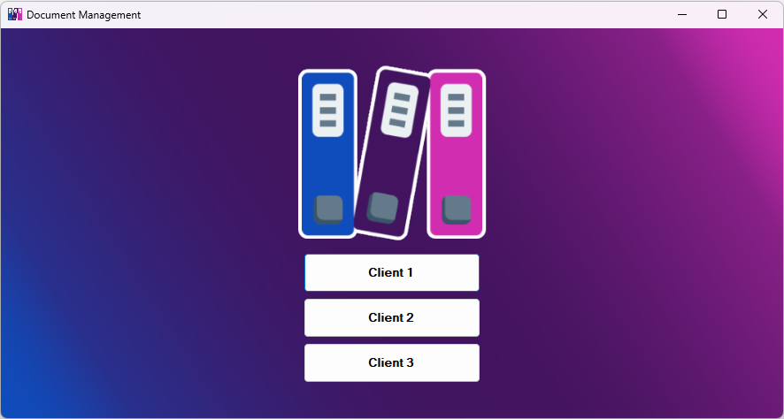
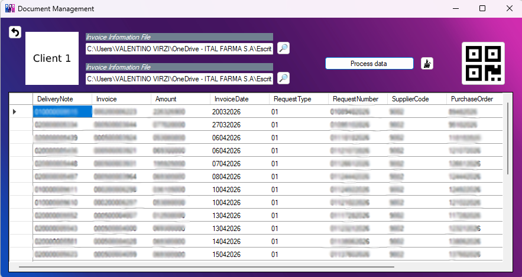
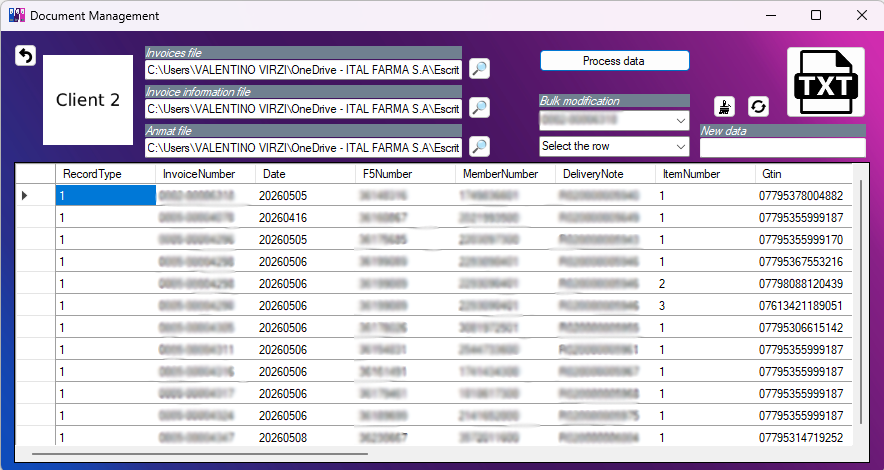
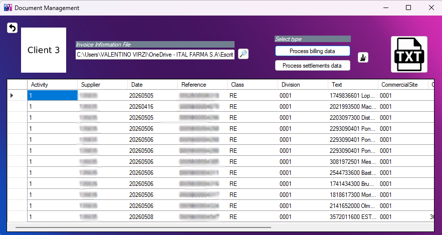

# Document Management App

> Desktop application built with WinForms (.NET Framework 4.8) to automate document processing and export workflows for healthcare insurance clients.



---

## 📋 Table of Contents
- [Overview](#overview)
- [Architecture](#architecture)
- [Features](#features)
- [Tech Stack](#tech-stack)
- [Design Patterns](#design-patterns)
- [Project Structure](#project-structure)
- [Getting Started](#getting-started)
- [Screenshots](#screenshots)

---

## Overview

Document Management App is a real-world productivity tool built to replace a fully manual document processing workflow at a pharmaceutical company.

It imports HTML-based Excel reports generated by an external healthcare management system, transforms the raw data into the specific format required by each client, and exports the results as `.txt` or `.pdf` files — reducing a task that previously took hours to a matter of seconds.

The application was originally developed under time pressure as an internal tool. It was later **refactored entirely from scratch** for this portfolio to demonstrate clean architecture, proper encapsulation, SOLID principles, and professional C# conventions.

---

## Architecture

The project follows a **layered architecture** with clear separation of concerns:

```
DocumentManagementApp/
├── Core/
│   ├── Interfaces/       → IClientExporter contract
│   ├── Base/             → ClientExporterBase (shared logic)
│   └── Factory/          → ClientExporterFactory (creational pattern)
├── Clients/
│   ├── Client1/          → QR-based PDF exporter
│   ├── Client2/          → Multi-source TXT exporter with ANMAT integration
│   └── Client3/          → Billing and Settlements exporters
├── Infrastructure/
│   ├── Import/           → HTML Excel, native Excel, and ANMAT TXT importers
│   └── Export/           → QR code generator and PDF exporter
└── UI/
    └── MainForm          → WinForms UI (navigation + event handling only)
```

---

## Features

- **Multi-client support** — Each client has its own export format handled by a dedicated exporter class
- **HTML Excel import** — Parses `.xls` files saved as HTML using HtmlAgilityPack
- **ANMAT TXT import** — Parses fixed-width government registry files; company name filter is injected via constructor (configurable)
- **QR PDF export** — Generates paginated PDF files where each row is encoded as a QR code (Client1)
- **TXT export** — Exports fixed-width formatted text files with two configurable grouping strategies: one file per invoice, or groups of up to 200 lines without splitting invoices (Client2)
- **Bulk edit tool** — Allows mass editing of table values grouped by invoice number before exporting (Client2)
- **Bug fix** — Corrected a silent bug where `DateTime.AddDays()` result was discarded. `DateTime` is a struct — immutable — so the result must always be captured in a new variable

---

## Tech Stack

| Technology | Purpose |
|---|---|
| C# / .NET Framework 4.8 | Core language and runtime |
| WinForms | Desktop UI |
| HtmlAgilityPack | HTML Excel file parsing |
| NPOI | Native Excel file parsing (.xls / .xlsx) |
| iText7 | PDF generation |
| ZXing.Net | QR code generation |

---

## Design Patterns

### Factory Pattern
`ClientExporterFactory` decouples the UI from concrete exporter implementations. The form only calls `GetClientExporter("client1")` — it has no knowledge of which class handles the logic.

### Template Method Pattern
`ClientExporterBase` defines the skeleton of the export algorithm. Subclasses override `GenerateFormattedTable()` and `CreateResultTable()` to provide client-specific behavior while reusing shared infrastructure.

### Strategy Pattern
Export behavior varies per client. `ExportToFile()` is overridden independently in each exporter — Client1 exports PDF, Client2 exports grouped TXT files, Client3 uses the default TXT implementation from the base class.

---

## Project Structure

### Core/
- **`IClientExporter`** — Contract that all exporters must implement: `GenerateFormattedTable`, `ExportToFile`, `CreateResultTable`, `SetSourceFiles`
- **`ClientExporterBase`** — Abstract base class with shared file import logic and default TXT export. File paths are encapsulated as `protected` properties with `private` backing fields
- **`ClientExporterFactory`** — Returns the correct exporter instance based on a client identifier string. Throws a descriptive `ArgumentException` for unrecognized clients

### Clients/
- **`Client1Exporter`** — Generates a table with invoice and CAE data, cross-referenced against a secondary file. Exports as a QR-coded PDF
- **`Client2Exporter`** — Integrates three data sources: main file, invoice information, and ANMAT government registry. Exports as fixed-width TXT with configurable grouping
- **`Client3BillingExporter`** — Aggregates quantities by invoice/product key using a dictionary, calculates amounts and totals
- **`Client3SettlementsExporter`** — Deduplicates invoices using a HashSet and formats settlement data

### Infrastructure/
- **`HtmlExcelImporter`** — Parses HTML-based `.xls` files into DataTables. Handles variable row lengths defensively
- **`ExcelImporter`** — Parses native `.xls`/`.xlsx` files using NPOI
- **`AnmatTxtImporter`** — Parses fixed-width ANMAT government registry files. Company name filter is injected via constructor — no hardcoded values
- **`QrGenerator`** — Encodes DataRow content into a QR code PNG. Uses `StringBuilder` for efficient string concatenation
- **`QrPdfExporter`** — Builds paginated A4 PDF documents with one QR code per page using iText7. Layout constants are named and centralized

---

## Getting Started

### Prerequisites
- Visual Studio 2019 or later
- .NET Framework 4.8

### Installation

```bash
git clone https://github.com/VVirzi/DocumentmanagementApp.git
```

1. Open `DocumentManagementApp.sln` in Visual Studio
2. Restore NuGet packages: **Tools → NuGet Package Manager → Restore**
3. Build the solution: **Build → Rebuild Solution**
4. Run with `F5`

### NuGet Packages
```
HtmlAgilityPack
NPOI
itext7
ZXing.Net
```

---

## Screenshots

### Main Menu


### Client 1 — QR PDF Export


### Client 2 — TXT Export with Bulk Edit Tool


### Client 3 — Billing and Settlements

